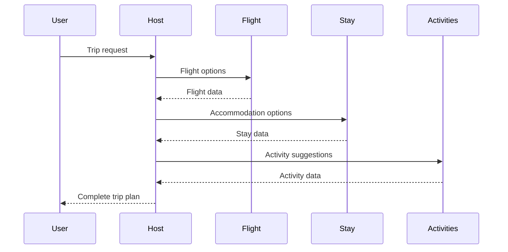

# Gemini A2A (Agent-to-Agent) System

## Project Overview
This is an agent-to-agent system for travel planning, consisting of multiple specialized agents that work together to plan trips. The system includes:
- Host Agent: Coordinates the trip planning process
- Flight Agent: Suggests flight options
- Stay Agent: Recommends hotel/stay options
- Activities Agent: Suggests tourist activities

## Installation
1. Ensure Python 3.12+ is installed
2. Create and activate a virtual environment:
```bash
python -m venv venv
source venv/bin/activate
```
3. Install dependencies:
```bash
pip install -r requirements.txt
```

## Configuration
Each agent has its own `.env` file in its directory for configuration.

## Running the System

To start all agents and the Streamlit app, run these commands in separate terminal windows:
```bash
uvicorn agents.host.__main__:app --port 10000 &
uvicorn agents.flight.__main__:app --port 10001 &
uvicorn agents.stay.__main__:app --port 10002 &
uvicorn agents.activities.__main__:app --port 10003 &
streamlit run app.py
```

To stop all services, run:
```bash
for port in {10000..10003}; do kill -9 $(lsof -t -i :$port); done
```


## System Architecture


## API Documentation
Each agent exposes an `execute()` function that accepts a request dictionary with these parameters:
- `destination` (string): Travel destination
- `start_date` (string): Trip start date
- `end_date` (string): Trip end date
- `budget` (number): Budget in USD

Flight agent additionally requires:
- `origin` (string): Departure location

## Response Format
- Host Agent: Returns a summary text
- Flight Agent: Returns flight options as text
- Stay Agent: Returns stay options as text
- Activities Agent: Returns activities in JSON format